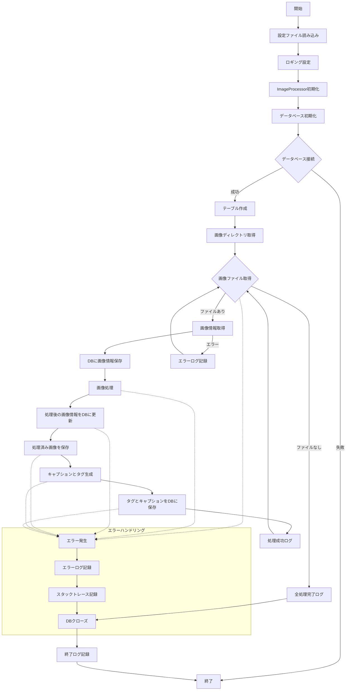
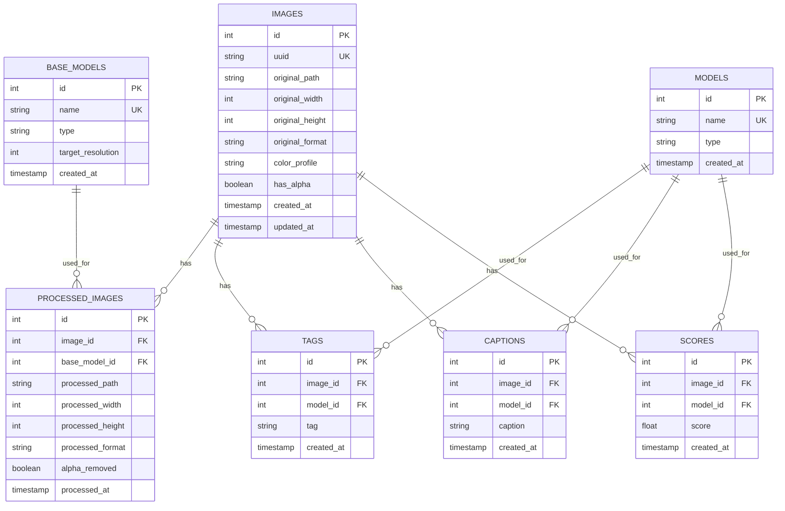

# main.py

```mermaid
flowchart TD
    A[開始] --> B[設定ファイル読み込み]
    B --> C[ロギング設定]
    C --> D[ImageProcessor初期化]
    D --> E[データベース初期化]
    E --> F{データベース接続}
    F -->|成功| G[テーブル作成]
    F -->|失敗| Z[終了]
    G --> H[画像ディレクトリ取得]
    H --> I{画像ファイル取得}
    I -->|ファイルあり| J[画像情報取得]
    I -->|ファイルなし| W[全処理完了ログ]
    J --> K[DBに画像情報保存]
    K --> L[画像処理]
    L --> M[処理後の画像情報をDBに更新]
    M --> N[処理済み画像を保存]
    N --> O[キャプションとタグ生成]
    O --> P[タグとキャプションをDBに保存]
    P --> Q[処理成功ログ]
    Q --> I
    J -->|エラー| R[エラーログ記録]
    R --> I
    W --> X[DBクローズ]
    X --> Y[終了ログ記録]
    Y --> Z[終了]

    subgraph エラーハンドリング
    S[エラー発生] --> T[エラーログ記録]
    T --> U[スタックトレース記録]
    U --> X
    end

    I -.-> S
    L -.-> S
    M -.-> S
    N -.-> S
    O -.-> S
    P -.-> S

```

```mermaid
erDiagram
    IMAGES ||--o{ PROCESSED_IMAGES : has
    IMAGES ||--o{ TAGS : has
    IMAGES ||--o{ CAPTIONS : has
    IMAGES ||--o{ SCORES : has
    MODELS ||--o{ TAGS : used_for
    MODELS ||--o{ CAPTIONS : used_for
    MODELS ||--o{ SCORES : used_for
    BASE_MODELS ||--o{ PROCESSED_IMAGES : used_for

    IMAGES {
        int id PK
        string uuid UK
        string original_path
        int original_width
        int original_height
        string original_format
        string color_profile
        boolean has_alpha
        timestamp created_at
        timestamp updated_at
    }

    PROCESSED_IMAGES {
        int id PK
        int image_id FK
        int base_model_id FK
        string processed_path
        int processed_width
        int processed_height
        string processed_format
        boolean alpha_removed
        timestamp processed_at
    }

    BASE_MODELS {
        int id PK
        string name UK
        string type
        int target_resolution
        timestamp created_at
    }

    TAGS {
        int id PK
        int image_id FK
        int model_id FK
        string tag
        timestamp created_at
    }

    CAPTIONS {
        int id PK
        int image_id FK
        int model_id FK
        string caption
        timestamp created_at
    }
        SCORES {
        int id PK
        int image_id FK
        int model_id FK
        float score
        timestamp created_at
    }

    MODELS {
        int id PK
        string name UK
        string type
        timestamp created_at
    }

```